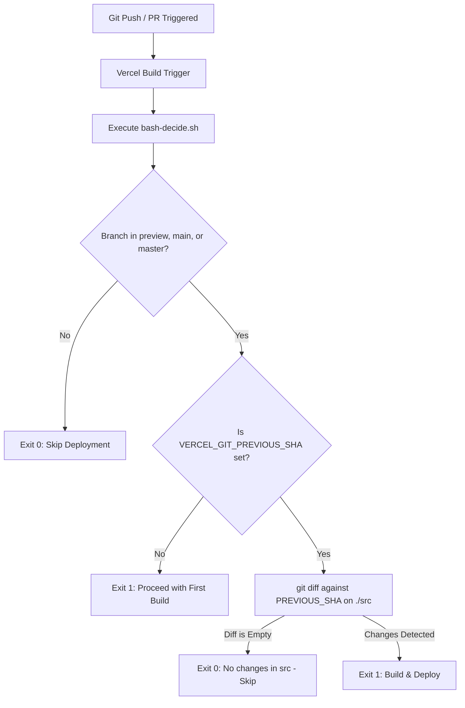

# 07 - Deployment & Environment Configuration

## 1. Overview
The **P2P Peer Meeting** application is built as a zero-backend, client-side Single Page Application (SPA). Because media exchange and chat occur strictly peer-to-peer over WebRTC, the application requires **no custom media relay server, backend database, or Node.js runtime in production**.

The application can be built into static assets (`HTML`, `JS`, `CSS`) and hosted on any global Content Delivery Network (CDN) or edge hosting platform, including **Vercel**, **Cloudflare Pages**, **Netlify**, or **AWS S3 + CloudFront**.

---

## 2. Environment Variables

Client-side environment variables are bundled during build time using Vite's `import.meta.env` mechanism. Only variables prefixed with `VITE_` are exposed to the client bundle.

| Variable Name | Required | Default / Example | Purpose |
| :--- | :---: | :--- | :--- |
| `VITE_SUPABASE_URL` | **Yes** | `https://xyzcompany.supabase.co` | Supabase project endpoint hosting Realtime WebSockets. |
| `VITE_SUPABASE_ANON_KEY` | **Yes** | `eyJhbGciOiJIUzI1Ni...` | Public anonymous JWT key authorizing Realtime channel subscriptions. |

### Configuration Workflow:
1. Sign in to your [Supabase Dashboard](https://supabase.com/dashboard).
2. Select or create your project.
3. Navigate to **Project Settings** -> **API**.
4. Copy the **Project URL** and the `anon public` API Key.
5. In your local development environment, copy `.env.example` to `.env`:
   ```bash
   cp .env.example .env
   ```
6. Populate the variables:
   ```env
   VITE_SUPABASE_URL=https://your-project-id.supabase.co
   VITE_SUPABASE_ANON_KEY=your-supabase-anon-key-here
   ```

### Runtime Credential Fallback:
In [`src/services/supabase.ts`](../src/services/supabase.ts), the application evaluates credentials using a prioritized fallback chain:
1. `import.meta.env.VITE_SUPABASE_URL` and `VITE_SUPABASE_ANON_KEY` (rejecting placeholder values containing `your-project-id`).
2. Browser `localStorage` under key `p2p_meeting_supabase_config`.
3. If neither is available, `getSupabaseClient()` safely returns `null`, prompting the user in the UI to supply valid credentials before attempting to join or create rooms.

---

## 3. Build & Quality Pipeline

The application build pipeline is managed via npm scripts in `package.json`:

```json
{
  "scripts": {
    "dev": "vite",
    "build": "tsc && vite build",
    "preview": "vite preview"
  }
}
```

### Build Steps:
1. **TypeScript Compilation (`tsc`)**:
   - Executes the TypeScript compiler against `tsconfig.json`.
   - Validates type safety across all React components, WebRTC hooks, and signaling payloads.
   - Enforces strict null checks, `noUnusedLocals`, and `noUnusedParameters`.
   - Emits no JavaScript files (`"noEmit": true`), serving strictly as a compile-time static type assertion.
2. **Vite Production Bundler (`vite build`)**:
   - Parses `index.html` as the SPA entry point.
   - Treeshakes unused code from `@supabase/supabase-js` and `lucide-react`.
   - Processes CSS through PostCSS and Tailwind CSS, purging unused utility classes.
   - Minifies JavaScript using ESBuild for optimal asset compression.
   - Emits production-ready static assets into the `dist/` directory.

---

## 4. Vercel Continuous Deployment & Branch Filtering

The project uses Vercel for automated CI/CD previews and production deployments. To prevent unnecessary builds on feature or documentation branches and optimize build minute usage, the repository implements a custom **Ignored Build Step** script: [`bash-decide.sh`](../bash-decide.sh).



### Script Logic (`bash-decide.sh`):
1. **Branch Whitelist**:
   - Checks `$VERCEL_GIT_COMMIT_REF`.
   - Only allows branches matching `preview`, `main`, or `master`.
   - Any commit on `dev`, topic branches, or standalone pull requests exits with code `0` (indicating to Vercel that the build should be cancelled).
2. **Initial Deployment Check**:
   - If `$VERCEL_GIT_PREVIOUS_SHA` is empty (initial deployment for a branch), exits with code `1` to trigger the build.
3. **Source Code Diffing**:
   - Runs `git diff $VERCEL_GIT_PREVIOUS_SHA HEAD --quiet -- ./src`.
   - If no files under `./src` have changed (for example, when updating documentation in `docs/` or adjusting repository markdown files), exits with code `0` to skip the build.
   - If changes are detected under `./src`, exits with code `1` to build and deploy.

### Vercel Project Configuration:
- **Build Command**: `npm run build`
- **Output Directory**: `dist`
- **Install Command**: `npm install`
- **Ignored Build Step**: `bash bash-decide.sh`
- **Environment Variables**: Define `VITE_SUPABASE_URL` and `VITE_SUPABASE_ANON_KEY` in **Project Settings > Environment Variables** for `Production` and `Preview` environments.

---

## 5. Cloudflare Pages & Alternative CDNs

Because the output in `dist/` consists purely of static files, it can be deployed to Cloudflare Pages:

### Deploying via Wrangler CLI:
```bash
# 1. Build the production bundle
npm run build

# 2. Deploy dist directory to Cloudflare Pages
npx wrangler pages deploy dist --project-name=p2p-meeting
```

### Single Page Application (SPA) Routing:
All peer meeting room URLs take the query-parameter format:
```
https://meeting.example.com/?room=marketing-sync
```
Because the room ID is maintained via URL parameters rather than subpaths, standard web servers and static CDNs require no complex rewrite or 404-fallback rules; `index.html` loads directly and parses `window.location.search`.

---

## 6. WebRTC Network Diagnostics & Troubleshooting

WebRTC relies on direct peer-to-peer transport over UDP. In real-world enterprise, university, or mobile cellular networks, firewalls and Network Address Translators (NATs) may introduce connectivity challenges.

### 6.1 STUN vs. TURN Architecture
- **STUN (Session Traversal Utilities for NAT)**:
  - The application is configured with Google's public STUN servers:
    - `stun:stun.l.google.com:19302`
    - `stun:stun1.l.google.com:19302`
  - STUN servers discover the public IP address and port allocated by the peer's NAT router (producing `srflx` - Server Reflexive ICE candidates).
  - STUN incurs zero media bandwidth cost because it only inspects the initial UDP packet header during candidate gathering.
- **TURN (Traversal Using Relays around NAT)**:
  - When both peers are behind **Symmetric NAT** (common in enterprise firewalls and restrictive mobile data carriers), the port mapping changes for every destination socket, preventing direct hole punching.
  - In a symmetric-to-symmetric scenario, STUN fails to connect. A TURN relay server is required to bridge the media traffic (`relay` ICE candidates).
  - *Note: To maintain a zero-cost serverless model, the application currently uses public STUN. For enterprise deployments requiring 100% traversal guarantees, custom TURN servers (e.g. Coturn or Twilio Network Traversal Service) can be added to the `iceServers` array in `src/services/webrtc.ts`.*

### 6.2 Common Failure Modes & Diagnostics

| Symptom | Root Cause | Diagnosis & Resolution |
| :--- | :--- | :--- |
| **ICE Connection State: `failed` or `disconnected`** | Symmetric NAT or firewall UDP blocking (ports 1024-65535 blocked). | Inspect `chrome://webrtc-internals`. If both peers only generated `host` candidates or STUN candidates failed to pair, a TURN relay server is required. |
| **"Failed to add incoming ice candidate: Unknown ufrag"** | Candidate arrived before the corresponding remote SDP description was set, or arrived after an uncoordinated ICE restart. | Resolved by candidate queueing in `PeerConnectionManager`. Ensure signaling messages maintain order. |
| **"Microphone/Camera Not Allowed" (`NotAllowedError`)** | Browser permission blocked or non-secure origin (`http://`). | WebRTC `getUserMedia()` strictly requires a **Secure Context** (`https://` or `http://localhost`). Ensure the app is served via HTTPS. Check browser site permissions. |
| **Echo or Feedback Whistle** | Participant using external speakers without headphones; echo cancellation disabled. | Open **Settings > Audio & Voice**, verify **Echo Cancellation** is toggled ON. Encourage wearing headphones. |
| **Choppy or Frozen Video** | Bandwidth saturation or CPU bottleneck under high-mesh load ($N(N-1)$ streams). | Open **Settings > Audio & Voice**, toggle **Bandwidth Saver** ON. Open **Video & Display** and reduce capture resolution to **480p SD**. |

### 6.3 Browser Debugging Tools
- **Chrome / Edge**: Open a new tab to `chrome://webrtc-internals`. Provides real-time graphs for:
  - `RTCIceCandidatePair`: Active candidate pair, round-trip time (RTT), and packets sent/received.
  - `RTCInboundRtpVideoStream`: Bitrate, frames decoded, packet loss, and jitter.
- **Firefox**: Open `about:webrtc`. Shows active SDP offer/answer exchanges, ICE candidate logs, and stream bandwidths.
- **Safari**: Enable **Develop > WebRTC** to inspect WebRTC logging in the Web Inspector console.
